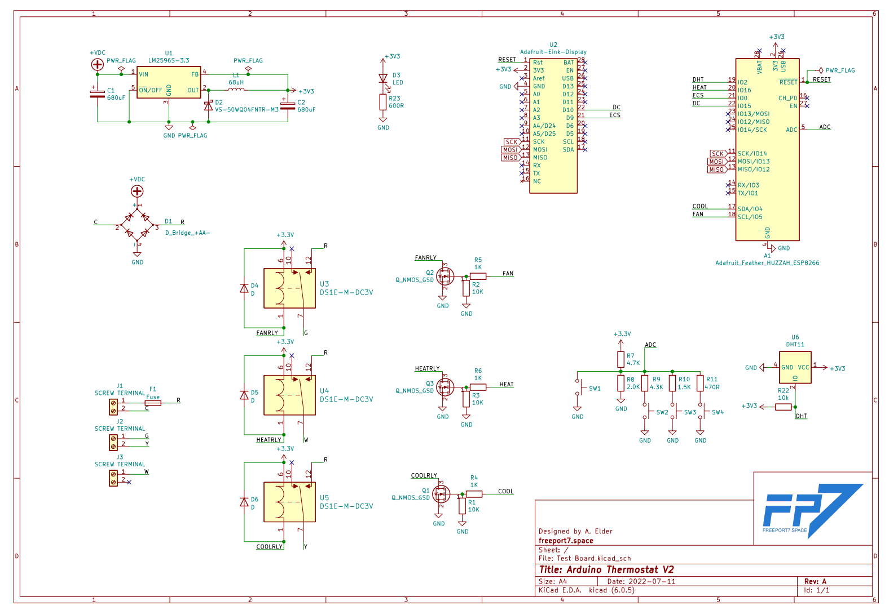
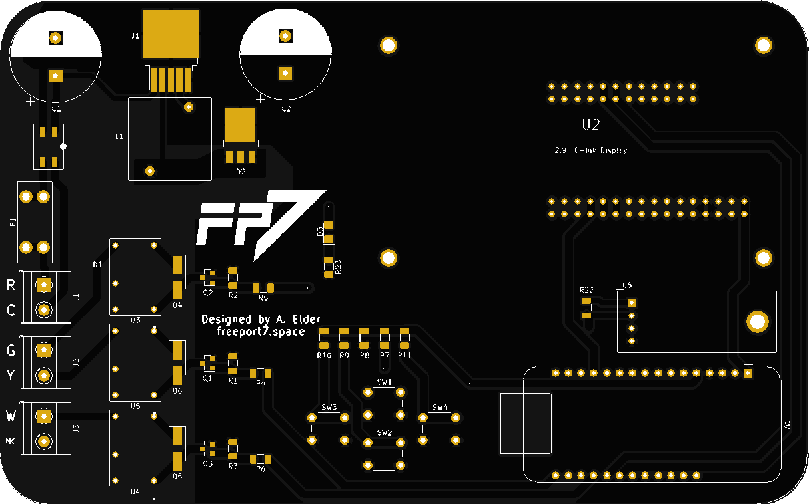

# Arduino-Thermostat

This is a project to create a arduino powered home thermostat. Version 1 PCB schematic and design is complete. Basic firmware is complete and V1 is currently controlling the temperature in my apartment.

# Electrical Design

The entire project was designed to be through hole for ease of assembly and troubleshooting. Perhaps in the future, a SMD version with a smaller footprint can be made once the electrical design is finalized.

## Power Section

This takes the 24v AC from the air handler transformer and rectifies it to create a higher voltage DC bus. This is then smoothed and an LM2596 is used as a switching regulator to create a 5.0v supply.

Power for the arduino is supplied via the 5v pin from the onboard voltage regulator.

The regulator can handle upto 3a of current and would be accurately described as "way overkill" for the power requirements of the low voltage section of this board. Once V1 is confirmed to be working, a redesign will be carried out that will allow a lower BOM cost and a physical design shrink.

Because the circuitry in the air handler requires the relays to be switched on with the supplied 24v AC, it is routed down the board to supply the common terminal of the three main relays.

## Relay Driver

A L293D Bipolar Motor Driver was chosen because it was readily available in DIP format, worked for the voltages required, had logic level inputs and had built in flyback diodes that allowed for less physical space usage at the expense of a higher BOM cost.

Additionally, due to the extra available output, the supply for the LCD backlight is switched with output 4.

## Inputs and Outputs

An arduino nano will be used to run the thermostat, ample GPIO meant that each physical button could have it's own DIO pin. Additionally, the LCD was able to be run directly in 4 bit parallel mode allowing for lower BOM cost and simpler electrical design.

The DHT11 may be swapped out with a DHT22 as they have the same footprint and the DHT 22 has a wider range of measurement.

## Physical Outline

The physical outline of the board was designed to mimic my current thermostat. 4 mounting holes were provided to allow for either wall mounting or a case.

## Lessons Learned for V2

- Arduino placement needs to be revised. Currently plugging in the USB cable is impossible without bending a cable and potentally damaging the Arduino. This is the biggest mistake.
- Screw terminal placement needs to be revised. Currently with the massive spacing, it required me to trim a lot of the insulation off of the 5 conductor cable in order to spread the wires out far enough to reach.
- More markings on the front of the PCB to show which screw terminal does what. Currently it requires me to open the schematic and board files to correctly wire the thermostat.
- More work should be done to minimize footprint. Currently, the thermostat is physically very large.
- A larger screen would be nice to fit more information. A dot matrix or OLED would be best.
- Smaller regulator section and relays would go a long way to making the board shrink.

# Programming

Currently a basic bare bones firmware has been written to allow basic functionality. No scheduling features exist and functionality is limited to only basic temperature control.

## Planned Future Development

- Backlight timeout. Currently the LCD stays on all the time.
- PID control or other method for better temperature control.
- Humidistat control mode
- Adjustable circ fan frequency
- Better menu system
- Filtering on the temperature sensor to prevent rapid cycling
- Cycling time limit to prevent compressor damage

